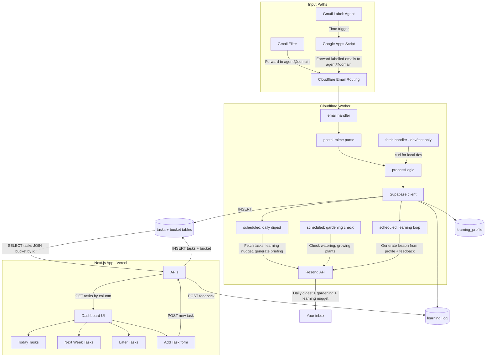

# Dad-Ops Agent: Detailed Implementation Plan

## Current State

The project already has a solid foundation ([src/index.ts](src/index.ts)):

- **Email handler**: Receives `ForwardableEmailMessage`, parses with `postal-mime`
- **Fetch handler**: Accepts POST with `{ subject, body, from }` for local dev/testing only (curl)
- **Shared `processLogic**`: Stub that logs and returns; no persistence yet

[plan/PROJECT.md](plan/PROJECT.md) defines the full vision. This plan focuses on **Phase 1 (Ingestion MVP)** and sets up **Phase 2 (Intelligence)**.

---

## Architecture Overview

The system has four main parts:

- **Input paths:** Gmail filters and Apps Script forward emails to `agent@domain` → Cloudflare Email Routing → Worker.
- **Worker:** Handles incoming emails (parse, persist to Supabase), plus two cron jobs: daily digest (compile tasks, send email) and gardening check (watering, growing plants, seasonal tips).
- **Next.js app:** Dashboard with 3-column task view, Add Task form, APIs to read/write tasks.
- **Supabase:** `tasks` + bucket tables; `learning_profile` (curriculum settings); `learning_log` (AI-generated lessons + feedback).



**Cron jobs (Phase 4):** Three scheduled handlers in the Worker:
- **Daily digest** (06:30 Stockholm): Compile tasks, fetch weather (display + rain→remind rain coat), learning nugget, send via Resend.
- **Gardening/watering** (daily or weekly): Based on `plants_at_home` (no weather); watering reminders + seasonal tips.
- **Learning loop** (or bundled with daily digest): Generate bite-sized lesson from `learning_profile` + recent `learning_log` feedback; send via email; user submits feedback to dashboard.

**Next.js App (Vercel):** APIs fetch tasks by joining `tasks` with bucket tables (today/this_week/later) and accept POST to add new tasks (insert into `tasks` + add `task_id` to chosen bucket). The dashboard renders a 3-column Trello-style view: **Today**, **This Week**, **Later**, plus an **Add Task** form. Users can create tasks manually, mark tasks done (optimistic UI updates), and view original email bodies for context.

---

## Phase 1: Ingestion MVP (Detailed Tasks)

### 1.1 Supabase Setup

- Create Supabase project (if not exists) and obtain:
  - Project URL
  - `service_role` or `anon` key (service_role for server-side Worker)
- Create `tasks` table (full task data) + three bucket tables (task IDs only):

```sql
CREATE TABLE tasks (
  id UUID PRIMARY KEY DEFAULT gen_random_uuid(),
  created_at TIMESTAMPTZ DEFAULT NOW(),
  title TEXT,
  original_body TEXT,
  due_date TIMESTAMPTZ,
  status TEXT DEFAULT 'pending',
  metadata JSONB,
  source TEXT DEFAULT 'email'
);

-- Bucket tables: list of task IDs only
CREATE TABLE today_tasks (
  task_id UUID PRIMARY KEY REFERENCES tasks(id) ON DELETE CASCADE
);

CREATE TABLE this_week_tasks (
  task_id UUID PRIMARY KEY REFERENCES tasks(id) ON DELETE CASCADE
);

CREATE TABLE later_tasks (
  task_id UUID PRIMARY KEY REFERENCES tasks(id) ON DELETE CASCADE
);
```

- Add Row Level Security (RLS) policies if using `anon` key; for `service_role`, RLS is bypassed.
- **Moving tasks:** Delete `task_id` from source bucket, insert into target bucket. Task row stays in `tasks`.

### 1.1b Learning Plan Tables

```sql
-- Curriculum settings (one row per topic you're learning)
CREATE TABLE learning_profile (
  id UUID PRIMARY KEY DEFAULT gen_random_uuid(),
  topic TEXT NOT NULL,                    -- e.g., "Distributed Systems"
  current_level TEXT,                     -- e.g., "Senior")
  daily_goal TEXT,                        -- e.g., "Bite-sized (2 min read)"
  target_duration_minutes INT DEFAULT 2,   -- Optional: for clarity
  status TEXT DEFAULT 'active',           -- 'active' | 'paused'
  curriculum_outline JSONB,               -- Optional: subtopics, milestones
  created_at TIMESTAMPTZ DEFAULT NOW(),
  updated_at TIMESTAMPTZ DEFAULT NOW()
);

-- Log of AI-generated lessons + user feedback
CREATE TABLE learning_log (
  id UUID PRIMARY KEY DEFAULT gen_random_uuid(),
  profile_id UUID REFERENCES learning_profile(id) ON DELETE CASCADE,
  content TEXT NOT NULL,                  -- The text the AI generated
  feedback TEXT,                          -- 1-5 or "Too easy" | "Too hard" | "Irrelevant"
  created_at TIMESTAMPTZ DEFAULT NOW()
);

-- Optional: CHECK constraint for feedback
-- ALTER TABLE learning_log ADD CONSTRAINT feedback_valid CHECK (
--   feedback ~ '^[1-5]$' OR feedback IN ('Too easy', 'Too hard', 'Irrelevant')
-- );
```

**Design notes:**
- `profile_id` links each lesson to a topic so Gemini can tailor content and we can analyze feedback per topic.
- `feedback` as TEXT supports both numeric (1–5) and categorical labels; validate in app or use CHECK.
- `curriculum_outline` (JSONB) can store subtopics, milestones, or a structured curriculum for advanced personalization.

### 1.2 Worker: Supabase Integration

- Add `@supabase/supabase-js` to dependencies.
- Add bindings in [wrangler.toml](wrangler.toml):
  - `SUPABASE_URL` and `SUPABASE_SERVICE_KEY` as **secrets** (set via `wrangler secret put`).
- In `processLogic`:
  - Initialize Supabase client with `createClient(env.SUPABASE_URL, env.SUPABASE_SERVICE_KEY)`.
  - Map parsed fields to `tasks` columns:
    - `title` ← `subject` (or first 100 chars)
    - `original_body` ← `body` (text or HTML fallback)
    - `metadata` ← `{ from, receivedAt }`
    - `source` ← `'email'`
  - Insert into `tasks`, then add `task_id` to `later_tasks` bucket (Phase 2 Gemini will suggest which bucket).
  - Return `{ success, taskId }` or error.

### 1.3 Email Handler: Persist and Drop

- After parsing, call `processLogic` with `source: 'email'`.
- Do **not** call `message.forward()` — emails are processed and dropped.
- On Supabase success: optionally `ctx.waitUntil()` for any async side effects.
- On error: call `message.setReject("Processing failed")` to return SMTP error.

### 1.4 Local Development and Verification

- `.dev.vars` (gitignored) for local secrets:
  ```
  SUPABASE_URL=https://xxx.supabase.co
  SUPABASE_SERVICE_KEY=eyJ...
  ```
- `wrangler dev` loads `.dev.vars` automatically.
- Verify email path: `curl -X POST http://localhost:8787/cdn-cgi/handler/email ...` (see [Cloudflare local dev docs](https://developers.cloudflare.com/email-routing/email-workers/local-development)).
- Verify HTTP path (dev only): `curl -X POST http://localhost:8787 -H "Content-Type: application/json" -d '{"subject":"Test","body":"Hello","from":"test@gmail.com"}'`.

### 1.5 Cloudflare Dashboard Setup (Manual)

- **Email Routing**: Create custom address `agent@<your-domain>` (or similar).
- **Action**: "Send to a Worker" → select the deployed Worker.
- **Gmail**: Create filter that forwards matching emails to `agent@<your-domain>`.
- **Google Apps Script**: Create time-based trigger (e.g. every 5–10 min) that finds emails with label "→ Agent" and forwards them to `agent@<your-domain>`. Apps Script does only this—no webhooks, no API calls.

---

## Phase 2: Intelligence Layer (Next Steps)

- Add `@google/generative-ai` and `GEMINI_API_KEY` secret. Use model `gemini-2.5-flash`.
- **Create separate prompt files** in `src/prompts/`:
  - `task-extraction.ts` – prompt for email → task extraction (title, due_date, target_bucket)
  - `daily-briefing.ts` – prompt for daily digest narrative
  - `learning-lesson.ts` – prompt for bite-sized lesson generation
  - Optionally `index.ts` to re-export all prompts.
  - Each file exports a single prompt constant; include placeholders for dynamic values (e.g. `{{currentDate}}`, `{{weather}}`).
- In `processLogic`, after parsing:
  - Import prompt from `src/prompts/task-extraction.ts`.
  - Send `subject + body` to Gemini 2.5 Flash (`gemini-2.5-flash`) with `response_mime_type: "application/json"`.
  - Prompt: extract `title`, `due_date` (resolved), `target_bucket` (`today` | `this_week` | `later`), `priority`.
  - Insert into `tasks`, then add `task_id` to the appropriate bucket table.
- Design the "Master System Prompt" for Dad-specific rules (school clothes = high priority, Swedish/English mixed emails, etc.) in the prompt files.

---

## Phase 3: Next.js Dashboard (Summary)

- **API routes**: `GET /api/tasks/today`, `GET /api/tasks/this-week`, `GET /api/tasks/later` (JOIN `tasks` with bucket table) and `POST /api/tasks` (insert into `tasks` + add `task_id` to chosen bucket). Optional: `PATCH /api/tasks/move` to move a task between buckets (delete from one bucket, insert into another).
- **Learning APIs**: `GET /api/learning/profiles`, `POST /api/learning/profiles` (CRUD for learning_profile); `GET /api/learning/log` (recent lessons); `POST /api/learning/feedback` (submit feedback for a lesson by id).
- **Context APIs**: `GET /api/context`, `PATCH /api/context` — manage `family_context` (shopping_list, seasonal_interests, **plants_at_home**).
- **Dashboard**: 3-column Trello-style layout + Add Task form (user picks target bucket). Mark tasks done, view original email body. **Learning section**: View/edit profiles, view today's lesson, submit feedback. **Context section**: Edit plants at home, shopping list, seasonal interests.
- **Supabase**: Next.js uses `@supabase/supabase-js` (anon or service key) to read/write `tasks`, bucket tables, `learning_profile`, `learning_log`.

---

## Phase 4: Cron Jobs (Daily Digest + Gardening)

Two Cloudflare `scheduled` handlers in the Worker, configured in `wrangler.toml`:

### 4.1 Daily Digest Cron

- **Schedule:** `cron = "30 6 * * *"` (06:30 Stockholm = 05:30 UTC in winter; adjust for DST).
- **Logic:**
  1. Fetch pending tasks from Supabase (JOIN `tasks` with each bucket table where `status = 'pending'`).
  2. Fetch Stockholm weather (OpenWeather API) for display and rain reminder.
  3. **Weather use cases:**
     - Display today's weather in the digest.
     - If rain forecast → add reminder: "Tell kids to bring rain coat."
  4. Gemini generates a "Daily Briefing" narrative (prioritized, weather-aware).
  5. Send email via Resend to your verified address.
- **Secrets:** `RESEND_API_KEY`, `DIGEST_RECIPIENT_EMAIL`, `OPENWEATHER_API_KEY`.

### 4.2 Gardening / Watering Cron

- **Schedule:** `cron = "0 7 * * *"` (07:00 Stockholm) or `"0 7 * * 0"` (weekly Sunday).
- **Watering:** Does **not** depend on weather API. Based on plants the user has at home.
- **Logic:**
  1. Fetch `family_context` key `plants_at_home` (e.g. "tomato, basil, roses") — UI in Phase 3 to manage this.
  2. Use Gemini or rules to generate watering reminders based on plants + current date/season.
  3. Seasonal growing tips (e.g. "Start tomato seeds indoors", "Time to prune roses").
  4. Send via Resend (can be combined with daily digest or separate).
- **Until Phase 3 is done:** `plants_at_home` can be set via Supabase or a simple API.
- **Secrets:** `RESEND_API_KEY`, `GEMINI_API_KEY`.

### 4.3 Learning Loop (Cron or bundled with Daily Digest)

- **Schedule:** Same as daily digest (06:30) or separate (e.g. 06:00).
- **Logic:**
  1. Fetch active `learning_profile`(s) (`status = 'active'`).
  2. Fetch recent `learning_log` feedback (last 5–10 entries) to inform difficulty and relevance.
  3. Gemini generates a bite-sized lesson (60–120 sec read) based on topic, level, daily_goal, and feedback.
  4. Insert into `learning_log` (content only; feedback is null until user responds).
  5. Include lesson in daily digest email or send separately.
- **Feedback flow:** User submits feedback via Next.js dashboard (POST `/api/learning/feedback`) or via email reply. Stored in `learning_log.feedback`.
- **Secrets:** `GEMINI_API_KEY`, `RESEND_API_KEY`.

### 4.4 wrangler.toml Configuration

```toml
[triggers]
crons = ["30 6 * * *", "0 7 * * *"]
```

Worker exports a `scheduled` handler that dispatches by `event.cron` to the appropriate logic. Learning loop can run in the same 06:30 cron (before digest) or as a separate trigger.

---

## Similar Projects and References


| Resource                                                                                                          | Relevance                                         |
| ----------------------------------------------------------------------------------------------------------------- | ------------------------------------------------- |
| [postal-mime Cloudflare guide](https://postal-mime.postalsys.com/docs/guides/cloudflare-workers)                  | Email parsing in Workers                          |
| [Cloudflare Email Workers Runtime API](https://developers.cloudflare.com/email-routing/email-workers/runtime-api) | `ForwardableEmailMessage`, `setReject`, `forward` |
| [jldec/my-email-worker](https://github.com/jldec/my-email-worker)                                                 | Example Email Worker repo                         |
| [Gmail + Cloudflare Email Routing](https://mhrsntrk.com/blog/how-to-use-cloudflare-email-routing-with-gmail-smtp) | Gmail forwarding to custom domain                 |
| [Apps Script Gmail forward](https://developers.google.com/apps-script/reference/gmail/gmail-app#getmessagesforthreadsthreads) | Forward labelled emails to agent address          |
| [Cloudflare Cron Triggers](https://developers.cloudflare.com/workers/configuration/cron-triggers/)                           | Scheduled handlers for daily digest and gardening |


---

## Unclear / Deferred Items

1. **Google Apps Script**: Not in scope for Phase 1. When added: create script that runs every 5–10 min, finds threads with label "→ Agent", and forwards them to `agent@<your-domain>`. Single responsibility—no webhooks.
2. **Swedish/English prompts**: Handled in Phase 2 when designing the Gemini prompt.
3. **Cron jobs**: Phase 4; three handlers—daily digest (weather for display + rain reminder), gardening/watering (based on plants_at_home, no weather dependency), learning loop.

---

## File Changes Summary


| File                              | Changes                                                                                   |
| --------------------------------- | ----------------------------------------------------------------------------------------- |
| [package.json](package.json)      | Add `@supabase/supabase-js`                                                               |
| [wrangler.toml](wrangler.toml)    | No new bindings (secrets only); ensure `[[send_email]]` remains                           |
| [src/index.ts](src/index.ts)      | Supabase insert in `processLogic`, error handling in email handler; fetch handler for dev only |
| `src/prompts/task-extraction.ts`   | Phase 2: Task extraction prompt |
| `src/prompts/daily-briefing.ts`   | Phase 4: Daily digest narrative prompt |
| `src/prompts/learning-lesson.ts`  | Phase 4: Learning loop prompt |
| `.dev.vars`                       | Create (gitignored) for local secrets                                                     |
| `.gitignore`                      | Add `.dev.vars`                                                                           |
| `supabase/migrations/` (optional) | SQL migration for `tasks` + bucket tables + `learning_profile` + `learning_log` |
| Next.js app (Phase 3)             | Task APIs + Learning APIs (profiles, log, feedback); Dashboard: 3-column tasks + Learning section (profiles, today's lesson, feedback form); Context section (plants, shopping list) |
| Worker (Phase 4)                 | `scheduled` handler: daily digest (weather for display + rain reminder), gardening (watering from plants_at_home), learning loop; Resend; OpenWeather for digest only |
