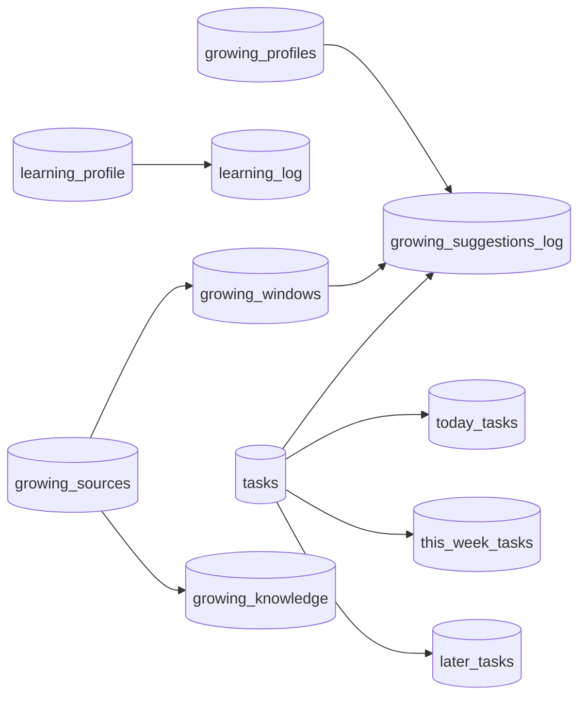

# Database Architecture

This document describes the Supabase/PostgreSQL data model for Dad-Ops and how core domains connect.

## Overview

- **Database**: PostgreSQL (Supabase)
- **Access model**: App/API access via Supabase client, with Row Level Security enabled
- **Primary domains**:
  - Tasks and buckets
  - Learning
  - Family context
  - Growing (profiles, sources, windows, knowledge, suggestions)

## Domain Model

### 1) Tasks and Buckets

- `tasks`
  - Core task entity (`title`, `due_date`, `status`, `source`, `metadata`)
  - Supports both normal tasks and typed records via `metadata` (for example renewals, promotions, growing conversions)
- Bucket membership tables:
  - `today_tasks`
  - `this_week_tasks`
  - `later_tasks`
  - Each uses `task_id` as PK + FK to `tasks(id)` with `ON DELETE CASCADE`

Design note: bucket tables intentionally separate membership from task payload, so moving across buckets is lightweight.

### 2) Learning

- `learning_profile`
  - Curriculum settings per topic/category
  - `profile_type` constrained to `topic | category`
- `learning_log`
  - Lesson entries and feedback
  - FK `profile_id -> learning_profile(id)` with `ON DELETE CASCADE`

### 3) Family Context

- `family_context`
  - Key-value preferences (shopping list, seasonal interests, etc.)
  - `key` is unique

### 4) Growing

- `growing_profiles`
  - User gardening profile (city, country, space type, experience, interests)
- `growing_sources`
  - Input sources for extraction (YouTube/blog)
  - Includes status pipeline (`queued | processing | done | failed`) and content fields:
    - `transcript`
    - `description`
    - `source_type` (youtube/blog)
    - `source_language`
- `growing_windows`
  - Seasonal actionable windows (month ranges, priority, bucket suggestion)
  - Can reference source via `source_id`
  - Includes user verification flag `verified`
- `growing_knowledge`
  - Extracted knowledge nuggets from sources
  - FK `source_id -> growing_sources(id)` with `ON DELETE CASCADE`
  - Includes `category`, `tags`, `season_relevance`, `location_note`, `language`
- `growing_suggestions_log`
  - Weekly suggestion lifecycle with status:
    - `pending | dismissed | converted | done`
  - Links:
    - `profile_id -> growing_profiles(id)` (`ON DELETE SET NULL`)
    - `window_id -> growing_windows(id)` (`ON DELETE SET NULL`)
    - `converted_task_id -> tasks(id)` (`ON DELETE SET NULL`)
  - Unique index on `(week_start_date, window_id)`

## Relationship Diagram

## Constraints and Integrity

- Extensive `CHECK` constraints enforce enums/ranges, including:
  - buckets (`today`, `this_week`, `later`)
  - growing suggestion kinds/statuses
  - months (`1..12`)
  - growing space/experience levels
- FK usage:
  - `ON DELETE CASCADE` where child data is meaningless without parent (`learning_log`, bucket rows, growing knowledge)
  - `ON DELETE SET NULL` where historical record should remain (`growing_suggestions_log` links)

## Indexing Strategy (Current)

- `growing_suggestions_log(week_start_date, window_id)` unique index
- `growing_sources(status, created_at)`
- `growing_knowledge(category, created_at DESC)`
- `growing_knowledge(source_id)`
- `growing_windows(source_id)`

## Security Model

- RLS is enabled on all primary application tables.
- Current policies are broad `authenticated` full-access policies per table.
- Authentication boundary is enforced in API handlers via `getAuthedSupabase()`.

Operational note: this is suitable for single-user/internal operation; multi-tenant hardening would require user/tenant ownership columns and restrictive policy predicates.

## Migration Evolution (Highlights)

- `001` base tasks + learning schema
- `002` family context table
- `003` RLS enablement and policies
- `004` learning profile type support
- `005` growing profile/windows/suggestions base + seed data
- `006` growing sources + knowledge + growing/source indexes
- `007` source transcript support
- `008` source description support
- `009` knowledge location metadata
- `010` multilingual fields (`source_language`, `language`)
- `010` windows verification flag
- `011` source type classification
