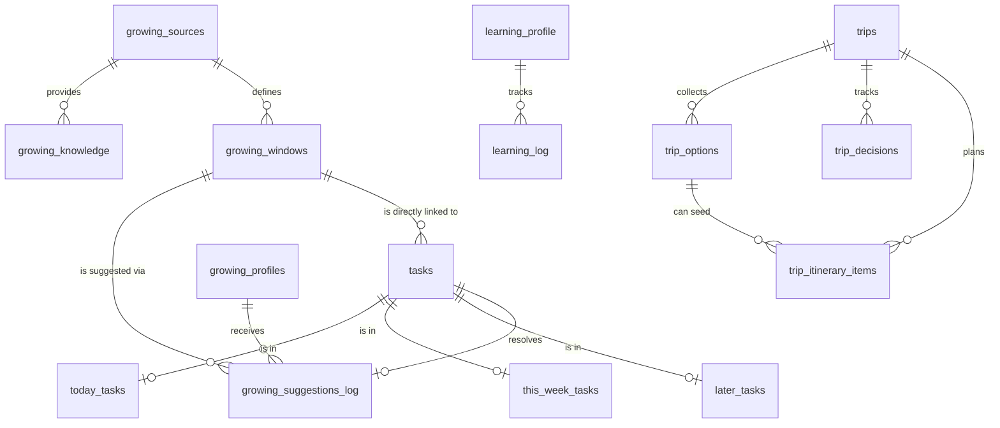

# Database Architecture

This document describes the Supabase/PostgreSQL data model for Dad-Ops, focusing on how core domains like Tasks, Learning, and Growing are structured and interconnected.

## Entity Relationship Diagram

---

## Core Tables

### 1. Tasks & Buckets
The task system separates core data from view-specific membership.

| Table | Purpose | Key Relationships |
|-------|---------|-------------------|
| `tasks` | Central repository for all task data (title, body, due date, metadata). | Parental to all bucket tables. Linked to `growing_windows.id`. |
| `today_tasks` | Specific list for tasks to be done today. | `task_id` -> `tasks.id` |
| `this_week_tasks` | Specific list for tasks planned for this week. | `task_id` -> `tasks.id` |
| `later_tasks` | Specific list for tasks deferred for later. | `task_id` -> `tasks.id` |

### 2. Growing (Garden Tracker)
The gardening domain manages seasonal windows, extraction from sources, and personalized suggestions.

| Table | Purpose | Key Relationships |
|-------|---------|-------------------|
| `growing_profiles` | User preferences (city, interests, space type). | - |
| `growing_sources` | Scraped content from YouTube or Blogs. | - |
| `growing_windows` | Seasonal catalog (e.g., "Start tomatoes" Feb-Apr). | `source_id` -> `growing_sources.id`. Referenced by `tasks.window_id`. |
| `growing_knowledge` | Extracted atomic tips and reference material. | `source_id` -> `growing_sources.id` |
| `growing_suggestions_log` | Weekly instances of windows suggested to the user. | `profile_id`, `window_id`, `converted_task_id` |

### 3. Learning
A curriculum-based system for daily micro-learning.

| Table | Purpose | Key Relationships |
|-------|---------|-------------------|
| `learning_profile` | Defines topics and current learning progress. | - |
| `learning_log` | History of daily lessons and user feedback. | `profile_id` -> `learning_profile.id` |

### 4. Trip Ops
Family travel planning with dedicated user-owned rows and task integration.

| Table | Purpose | Key Relationships |
|-------|---------|-------------------|
| `trips` | Trip shell: lifecycle, dates, logistics, participants, already-done history, preferences. Household-visible when attached to a household. | `user_id` -> `auth.users.id`, nullable `household_id` -> `households.id` |
| `trip_options` | Comparable activities, food stops, rainy-day backups, logistics options. | `trip_id` -> `trips.id` |
| `trip_decisions` | Open/waiting/decided trip choices. | `trip_id` -> `trips.id` |
| `trip_itinerary_items` | Loose day/block itinerary rows. | `trip_id` -> `trips.id`, optional `option_id` -> `trip_options.id` |
| `trip_preference_suggestions` | User-owned curated preference catalog for the suggestion picker. | `user_id` -> `auth.users.id` |
| `trip_knowledge_items` | Raw Markdown inspiration plus extracted trip knowledge used by option suggestions. | `trip_id` -> `trips.id` |
| `trip_knowledge_favorites` | Favorited merged places and activities from trip knowledge. | `trip_id` -> `trips.id` |
| `trip_share_links` | Opaque read-only public links for friends to view a trip plan. | `user_id` -> `auth.users.id`, `trip_id` -> `trips.id` |

---

## Key Connections & Data Flow

### The "Growing" Lifecycle
1. **Sources → Windows/Knowledge**: The extraction worker processes `growing_sources` and populates `growing_windows` (seasonal actions) and `growing_knowledge` (general tips).
2. **Profile + Windows → Suggestions**: A weekly cruncher matches user `interests` in `growing_profiles` against `growing_windows` to create records in `growing_suggestions_log`.
3. **Suggestions → Tasks**: When a user clicks "Add to Planner", a new entry in `tasks` is created. `growing_suggestions_log.converted_task_id` is updated, and `tasks.window_id` is populated directly.

### Task Conversion & Metadata
Tasks generated from other domains (like Renewals or Growing) store their origin in both direct columns and the `metadata` JSONB column:
- `item_type`: "growing", "renewal", "promotion", "trip_task"
- `window_id` (UUID): Direct reference to `growing_windows.id` (for growing tasks).
- `suggestion_id`: The specific log entry from the weekly run.
- `trip_id`: Trip Ops reference for trip planning tasks.

---

## Constraints & Security
- **RLS (Row Level Security)**: Enabled on all tables. Currently defaults to `authenticated` full access for the single-user model.
- **Cascading Deletes**: `ON DELETE CASCADE` is used for bucket memberships and extracted knowledge. `ON DELETE SET NULL` is used for suggestions and task-window links to preserve history.

---

## Detailed Schema Reference

### 1. Tasks Domain

#### `tasks`
Core task entity. Stores the unified payload for all task types.
- `id` (UUID, PK): Unique identifier.
- `created_at` (TIMESTAMPTZ): When the task was created.
- `title` (TEXT): The task headline.
- `original_body` (TEXT): The full description or extracted email body.
- `due_date` (TIMESTAMPTZ): Optional deadline.
- `status` (TEXT): Task state (`pending`, `done`).
- `window_id` (UUID, FK): Direct link to `growing_windows(id)`.
- `metadata` (JSONB): Specialized data (e.g., `item_type`, `suggestion_id`).
- `source` (TEXT): Origin of the task (default: `email`).

#### `today_tasks`, `this_week_tasks`, `later_tasks`
Membership tables for task buckets.
- `task_id` (UUID, PK, FK): Reference to `tasks(id)`. Uses `ON DELETE CASCADE`.

### 2. Growing Domain

#### `growing_profiles`
User gardening preferences and environment.
- `city` / `country_code`: Location for weather/growing season matching.
- `space_type`: `balcony`, `indoor`, `yard`, `mixed`.
- `experience_level`: `beginner`, `intermediate`, `advanced`.
- `interests`: Array of strings (e.g., `['tomato', 'herbs']`) used for suggestion scoring.

#### `growing_windows`
The static catalog of seasonal gardening opportunities.
- `item_key` (TEXT, Unique): Stable identifier for the window.
- `suggestion_kind`: `action` (must do) vs `inspiration` (nice to do).
- `start_month` / `end_month` (INT): The peak window for this activity (1-12).
- `priority` (INT): Default score for sorting.
- `verified` (BOOLEAN): Whether the window data has been human-reviewed.

#### `growing_suggestions_log`
The join table representing a specific window suggested to a specific profile for a specific week.
- `id` (UUID, PK): Unique identifier.
- `profile_id` (UUID, FK): Link to `growing_profiles(id)`.
- `window_id` (UUID, FK): Link to `growing_windows(id)`.
- `week_number` (INT): ISO week number associated with this suggestion row.
- `status`: `pending`, `dismissed`, `converted`, `done`.
- `converted_task_id` (UUID, FK): Links to the resulting task if "Add to Planner" was clicked.
- `title` (TEXT): Copied from window for historical record.
- `details` (TEXT): Copied from window for historical record.
- `suggestion_kind`: `action` vs `inspiration`.
- `suggested_bucket`: `today`, `this_week`, `later`.

#### `growing_sources` & `growing_knowledge`
Data from the ingestion pipeline (YouTube/Blogs).
- `growing_sources`: Tracks URLs, processing `status` (`queued`, `processing`, `done`), and full `transcript`.
- `growing_knowledge`: Individual tips extracted from sources. Includes `category` and `verified` status.

### 3. Learning Domain

#### `learning_profile`
- `topic`: The subject being learned.
- `curriculum_outline` (JSONB): The AI-generated path for this topic.

#### `learning_log`
- `content` (TEXT): The generated lesson text.
- `feedback` (TEXT): User rating/comments on the lesson quality.

### 4. Utilities

#### `family_context`
A simple key-value store for cross-cutting user preferences.
- `key` (TEXT, Unique): e.g., `shopping_list`, `seasonal_interests`.
- `value` (TEXT): The value associated with the key.

#### `promo_match_runs` & `promo_match_items`
Normalized storage for **manual imports** of Playwright output `watchlist-matches-only.json` (weekly promo tiles scored against `promo_watchlist`).
- **`promo_match_runs`**: One row per upload — `store_key`, `interests` (JSONB), `raw_json` (full payload), `created_at`, **`week_number`** (ISO week 1–53 at import, UTC; mirrors items for quick filtering without scanning children).
- **`promo_match_items`**: Child rows — `run_id`, `sort_order`, `week_number` (ISO week 1–53, UTC; same semantics as `growing_suggestions_log.week_number`), `interest`, `score`, `promotion_index`, `title`, `card_text`, `price_hint`, `image_url`, `source_url`, `store_key`. `ON DELETE CASCADE` from run.
- **RLS**: Same pattern as other single-user tables — `authenticated` full access.

#### `promotion_import_runs`, `weekly_promotions` & `weekly_promotion_matches`
Canonical storage for the newer weekly promotion flow: import **all** scraped
offers first, then run dashboard-side filtering for the current watchlist.
- **`promotion_import_runs`**: One row per weekly upload per store —
  `store_key`, `iso_year`, `week_number`, `source`, `imported_count`,
  `raw_json`. Multiple stores can have imports for the same ISO week, and one
  store can have multiple imports in a week when promotions are split into
  separate batches; current dashboard reads aggregate all runs for the selected
  `store_key` + ISO week. Aggregate reads merge duplicate visible offers by
  `store_key` plus a slugified title; raw import rows remain unchanged.
- **`weekly_promotions`**: Child rows for every scraped offer — `run_id`,
  `sort_order`, `store_key`, `promotion_index`, `title`, `card_text`,
  `price_hint`, `image_url`, `source_url`, optional category fields,
  `dedupe_key`, and `raw_json`.
- **`weekly_promotion_matches`**: Recomputed match rows — `run_id`,
  `promotion_id`, `interest`, `score`, `match_kind`, `match_reason`.
- **RLS**: Same single-user dashboard pattern — `authenticated` full access.

#### `food_style_favorite_suggestions`
Admin-editable mapping from cooking style to suggested watchlist favorites.
- **Columns**: `style_id`, `style_label`, `watchlist_text`, `priority`,
  optional `reason`, and `source`.
- **Use**: The Promo grocery watchlist page groups mappings by style so the user
  can add favorites for Vietnamese, Korean, Swedish/Nordic, and later styles.

#### `households`, `household_members` & `household_invites`
Account-backed family collaboration. A household has one owner and one or more
collaborators. The owner creates invite tokens; collaborators sign in or create
an account, then accept the invite.
- **`households`**: `name`, `created_by`, timestamps.
- **`household_members`**: `household_id`, `user_id`, `role`
  (`owner` / `collaborator`), `display_name`.
- **`household_invites`**: `token`, `role`, optional `email` / expiry,
  `accepted_by`, `accepted_at`.

#### `recipe_candidates` & `recipe_reviews`
Shared recipe sourcing workflow for `/family/recipes`.
- **`recipe_candidates`**: household-scoped incoming ideas with `title`,
  optional `source_url`, appended `notes`, `raw_text`, `image_urls`, and review
  `status`; `done` status hides an item from the default review queue.
- **`recipe_reviews`**: household-scoped comments/statuses for either a saved
  recipe or a recipe candidate.
- `saved_recipes.household_id` and `birthdays.household_id` are nullable bridge
  columns for later sharing of canonical recipes and birthdays through the same
  household model.

#### `recipe_import_queue`
Async source-import staging for `/recipe-generator?tab=import`.
- **Purpose**: Store pasted source URL/label and raw markdown until the Worker
  can extract a full recipe with AI.
- **Status**: `pending`, `processing`, `completed`, or `failed`.
- **Retry fields**: `attempts`, `last_error`, `run_after`,
  `processing_started_at`, and `processed_at`.
- **Output link**: `created_recipe_id` references the `saved_recipes` row made
  by the Worker.
- **RLS**: users manage rows where `user_id = auth.uid()`; the Worker uses the
  service role client for scheduled processing.

#### `recipe_share_links`
Read-only public sharing for the `/recipes` hub.
- **Purpose**: Opaque public links for either one saved recipe or all recipes in
  a food style, served at `/recipes/shared/[slug]`.
- **Columns**: `public_slug`, `scope_type` (`recipe` / `food_style`),
  nullable `recipe_id`, nullable `food_type_id`, `title`, `disabled_at`, and
  timestamps.
- **Access**: authenticated users manage their own links through RLS; anonymous
  readers use the `get_recipe_share_by_slug` SECURITY DEFINER RPC, which returns
  only public-safe recipe fields and never `source_markdown`.

#### `trip_share_links`
Read-only public sharing for Trip Ops.
- **Purpose**: Opaque public links for one trip, served at
  `/trips/shared/[slug]`.
- **Columns**: `public_slug`, `trip_id`, `title`, `disabled_at`, and
  timestamps.
- **Access**: authenticated users manage links for trips they own or can access
  through household membership; anonymous readers use the
  `get_trip_share_by_slug` SECURITY DEFINER RPC. The public payload includes
  trip basics, participant counts, non-rejected options, decisions, itinerary
  blocks, and knowledge favorites, but omits task rows and raw trip knowledge
  Markdown.

#### `vietnamese_meals` & `vietnamese_meal_recipe_links`
Recipe-first Vietnamese food catalog for `/vietnamese-meals`.
- **`vietnamese_meals`**: owner-scoped canonical meal rows with `name_vi`,
  optional `name_en`, `slug`, review `status`, tag arrays, structured
  `typical_ingredients`, lightweight `tourist_notes`, and AI confidence.
- **`vietnamese_meal_recipe_links`**: connects catalog meals to
  `saved_recipes` as `canonical`, `variant`, or `inspired_by`.
- **RLS**: authenticated users manage rows they created; collaborator access is
  blocked by dashboard middleware for this owner-only admin surface.
