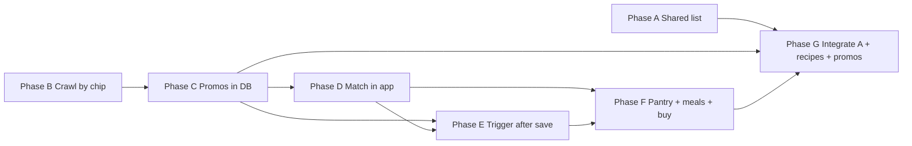

# Promo & shopping pipeline — sub-phases (roadmap)

**Purpose:** Single place to see **Phase A** (current focus) and **later sub-phases** for the ICA promotions → favorites → meals → buy list vision — without losing scope when work pauses.

**Related:** [shared-shopping-list.md](shared-shopping-list.md) (Phase A spec), [promotions-find-strategy.md](promotions-find-strategy.md), [promo-watchlist.md](promo-watchlist.md), [promo-meal-suggestions.md](promo-meal-suggestions.md), [recipe-generator.md](recipe-generator.md).

---

## Phase map (order of delivery)

| ID | Name | Focus | Status |
|----|------|--------|--------|
| **A** | Cook plan → prepare → shared shopping list | Recipes → **plan to cook** → **prepare** (at home / need) → **shopping list** + opaque share URL | [Specced](shared-shopping-list.md); build next |
| **B** | Weekly crawl (by category chip) | Script: open each ICA weekly-offers **category** chip; skip **All** (infinite scroll) | Planned |
| **C** | Promotions in DB | Import/store **all** scraped offers for a store + week (normalized, deduped) | Planned |
| **D** | Favorites matching in app | Move watchlist↔promo **matching** from Playwright into **server** logic; persist “favorite” or scored rows | Planned |
| **E** | Post-import job | After **C** saves a run, **automatically** run **D** (queue or sync) | Planned |
| **F** | Favorites + pantry + meals + buy list | Screen: favorites + “at home” + **meal suggestions** (e.g. Gemini) → pick meals → **shopping diff** | Planned |
| **G** | Deep integration | Prefill shared list / meal flow from **favorite promos**, **saved recipes**, imports | Planned (after A + C) |

Phases **B–C–D–E** are the “big pipeline”; **A** is intentionally **first** so **recipe-grounded** shop lists and share UX exist before the crawl exists.

---

## Phase A — Cook plan → prepare → shared shopping list

**Goal:** Entry from **recipe library**: add recipes to **plan to cook** → **prepare** ingredients → **shopping list** → **share link** (see full spec).

**Doc:** [shared-shopping-list.md](shared-shopping-list.md)

**Outcomes:** `cook_plans` + items; prepare → `shared_shopping_lists`; `/shop/[slug]` public read; optional **MVP0** = single-recipe prepare before multi-recipe plan.

---

## Phase B — Crawl all weekly promotions (no “All” feed)

**Goal:** One Playwright (or scripted) flow that iterates **category filter chips** on the ICA weekly offers page and collects tiles **per chip**, skipping the chip that shows **all** offers (infinite scroll / hard to finish).

**Outcomes:**

- Documented runbook + script entry (e.g. `pnpm promo:weekly-by-chip`).
- Raw artifact per run: JSON (or NDJSON) with stable fields aligned to future **C** import.
- Deduping rules when the same offer appears under multiple chips.

**Risks:** ICA DOM changes; rate limiting — keep internal-only and polite.

**Depends on:** Nothing from C–G (can run locally first).

---

## Phase C — Save weekly promotions to the database

**Goal:** Upload/import pipeline from **B** output into Supabase: **store**, **week** (ISO), **offer identity**, title, text, price hint, image URL, source URL, category chip id/name if available.

**Outcomes:**

- Schema: e.g. `promotion_import_runs` + `promotions` (or evolution of `promo_match_*` — decide in design).
- Idempotent re-import for same store + week.
- Dashboard or CLI: “import this JSON”.

**Depends on:** **B** producing consistent JSON.

---

## Phase D — Favorites / matching logic in the app (not only Playwright)

**Goal:** Today matching lives in `apps/playwright-tools` ([match-promotions.ts](../../apps/playwright-tools/src/match-promotions.ts)) + imports. Move **core scoring** to **server-side** (shared package or API) so **watchlist strings** + **DB promotions** produce favorite/scored rows **without** a browser.

**Outcomes:**

- Reusable function: `(promotions[], watchlist[]) → matches[]` (same semantics as today, tests ported).
- DB rows linking interests to `promotion_id` (or equivalent) for a given run/week.

**Depends on:** **C** (promotions rows to match against).

---

## Phase E — Trigger matching after promotions save

**Goal:** When **C** completes an import for a run, automatically **enqueue** or run **D** for that `run_id` (and invalidate stale UI caches).

**Outcomes:**

- Job hook or explicit API: `POST /internal/recompute-matches?runId=` (auth as needed).
- Dashboard: “Matching…” / last matched at.

**Depends on:** **C** + **D**.

---

## Phase F — Screen: favorites + pantry + meal suggestions + what to buy

**Goal:** User-facing flow: see **favorite / matched** promos for the week, add **what I already have at home**, get **meal suggestions** from **Gemini** (or rules-first MVP) using **promos + pantry**, **select meals**, output **consolidated shopping list** (and optionally push into **Phase A** list).

**Outcomes:**

- UI route(s) under dashboard; reuse patterns from [promo-meal-suggestions.md](promo-meal-suggestions.md) / meal-plan where useful.
- Clear separation: suggestion output vs final “to buy” list.

**Depends on:** **D** + **E** (real data). Can **mock** promos for UI spikes before C is done.

---

## Phase G — Integration with shared list & recipes

**Goal:** From a **selected meal** or **favorite offer**, **prefill** a **Phase A** shared list or ingredient set; from [recipe-generator.md](recipe-generator.md) saved recipes, **send ingredients** to a shared list.

**Outcomes:**

- Buttons/links: “Open as shared shopping list”, “Add missing to list”.
- Optional FK `source_recipe_id` / `promotion_id` on list items (see open questions in [shared-shopping-list.md](shared-shopping-list.md)).

**Depends on:** **A** + stable data from **C**/**D**.

---

## Dependency diagram (high level)

*(Phase A can ship in parallel with B–C work.)*

---

## What to focus on now

1. **Implement Phase A** ([shared-shopping-list.md](shared-shopping-list.md)).
2. Keep **B–G** in this doc for planning; split into `docs/phases/NN-…/SCOPE.md` when you start a given phase.

---

## Changelog

| Date | Change |
|------|--------|
| 2026-04-09 | Initial sub-phase map (A–G) and dependency diagram |
| 2026-04-09 | Phase A reframed: recipe → **plan to cook** → **prepare** → shared shopping list (see [shared-shopping-list.md](shared-shopping-list.md)) |
