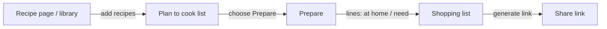

# Shared shopping list & cook plan (Phase A)

**Status:** specification (implementation next).  
**Priority:** ship before full weekly promo crawl + DB pipeline — validates cook-plan → prepare → share UX.

**Where this sits in the bigger plan:** [promo-shopping-pipeline-phases.md](promo-shopping-pipeline-phases.md) (Phases A–G).

---

## Problem & goal

**Who:** People who cook together and split shopping.

**Goal:** Start from **recipes** the user already has in the app, build a **plan to cook**, walk through **prepare** (what’s missing vs what to buy), then produce a **shopping list** someone else can open via **link** — without copying ingredients by hand.

**MVP outcome:** Recipe page / library → add recipes to **plan to cook** → **Prepare** → mark lines → **shopping list** → copy share URL → recipient sees read-only list.

---

## Product flow (canonical)



1. **Recipe page** ([recipe-generator.md](recipe-generator.md) — saved library + generator): user selects **one or more recipes** and **adds them to plan to cook** (queue / basket for meals).
2. **Plan to cook list:** ordered list of recipes the user intends to cook (week plan, ad-hoc backlog — product copy TBD). User can remove or reorder later.
3. **Prepare:** user opens **Prepare** from the plan (whole plan or **per recipe** in v1 — see open questions). UI shows **ingredient lines** (merged or per recipe).
4. On each line, user indicates **at home** vs **need to buy** (see **line semantics** below). The app derives **items to buy**.
5. **Shopping list:** consolidated lines (deduped where possible) with clear “buy” emphasis.
6. **Share:** same as before — **unguessable URL**, anonymous read for recipient.

**Note:** The earlier “type a meal title manually” path is **optional** later; **primary** entry is **recipes → plan → prepare**.

---

## Line semantics in Prepare

**Two states per ingredient line:**

- `at_home` — have it; not on the shared buy list.
- `need` — buy (default for “missing”).

The public shared list only exposes lines marked **`need`**. (A previous three-state model with `want` was dropped to reduce confusion.)

**Aggregation:** If two recipes both need “smör”, **merge** to one line with quantity text if the recipe data allows; otherwise show two lines with recipe tags (clearer, slightly longer list).

---

## Scope

### In scope (MVP)

- **Plan to cook** persisted per user: add/remove **saved recipes** (FK to `saved_recipes`).
- **Prepare** step: load ingredients from those recipes (same structure as saved recipe ingredients), apply line state → compute **shopping list**.
- **Shopping list** + **share URL** (opaque slug, public read-only) as in original decision.
- **Authenticated** owner; **Supabase** tables + RLS.

### Out of scope (later)

- Full ICA promo crawl / auto-fill from offers ([promotions-find-strategy.md](promotions-find-strategy.md)).
- Gemini meal suggestions from promos + pantry ([promo-meal-suggestions.md](promo-meal-suggestions.md)) — may **feed** plan to cook later.
- Recipients editing the list (Phase A.1).

### Optional MVP shortcut

If **plan + prepare** tables are heavy for a first slice: **MVP0** = Prepare from **one** recipe only (button on recipe detail: “Prepare shopping list”), still producing **shared_shopping_list**. Then add **plan to cook** as MVP1. Document explicitly if we time-box.

---

## User journeys

### Owner

1. Open **Recipe generator → Library** (or saved recipe detail) → **Add to plan to cook** on several recipes.
2. Open **Plan to cook** (new dashboard area or tab) → review queue → **Prepare**.
3. In **Prepare**, mark each ingredient **at home** or **need**.
4. **Generate shopping list** → review consolidated list → **Copy link**.

### Recipient

1. Open link → see **shopping list** (and optionally a short “From recipes: …” summary if we show provenance — not required for MVP).

---

## Entities (logical)

| Entity | Purpose |
|--------|---------|
| **CookPlan** (plan to cook) | `id`, `user_id`, `title` optional, `created_at`, `updated_at` — one active plan or many named plans (open question). |
| **CookPlanItem** | `plan_id`, `recipe_id` → `saved_recipes`, `sort_order`. |
| **SharedShoppingList** | `id`, `public_slug`, `title`, `created_by`, `created_at`, optional `source_plan_id` FK — the **output** of prepare/share. |
| **SharedShoppingListItem** | `list_id`, `sort_order`, `label` (text), `quantity` optional, `line_state` (`at_home` \| `need`), optional `source_recipe_id` for traceability. |

**Prepare** can be **computed in memory** until the user clicks “Create shopping list”, or we persist a **PrepareDraft** table for resume — defer unless we need multi-session.

**Share link:** unchanged — **anonymous read** by **unguessable `public_slug`**; [DECISIONS.md](../DECISIONS.md) entry still applies.

---

## URLs & UI (target)

| Area | Route / location |
|------|------------------|
| Plan to cook | e.g. `/plan-to-cook` or tab under recipe generator |
| Prepare | e.g. `/plan-to-cook/prepare` or modal wizard |
| Shared shopping list (public) | `/shop/[slug]` |
| APIs | `POST/PATCH` plans, `POST` generate list from plan prepare payload, `GET` public shop by slug |

Exact paths TBD in implementation.

---

## ERD sketch (Phase A)

```
┌─────────────────┐     ┌──────────────────┐     ┌─────────────────┐
│  cook_plans     │     │ cook_plan_items  │     │ saved_recipes   │
├─────────────────┤     ├──────────────────┤     │ (existing)      │
│ id              │──┐  │ plan_id (fk)     │──┐  └────────▲────────┘
│ user_id         │  └─>│ recipe_id (fk)   │──┘           │
│ title?          │     │ sort_order       │              │
└─────────────────┘     └──────────────────┘              │
                                                          │
┌─────────────────────────┐       ┌──────────────────────────────┐
│  shared_shopping_lists  │       │ shared_shopping_list_items   │
├─────────────────────────┤       ├──────────────────────────────┤
│ id, public_slug, title   │──┐    │ list_id, sort_order, label   │
│ created_by, source_plan?│  └──<│ line_state, source_recipe_id?│
└─────────────────────────┘       └──────────────────────────────┘
```

---

## Acceptance criteria (MVP)

1. From **saved recipes**, user can add **multiple** recipes to **plan to cook** and see them listed.
2. **Prepare** shows ingredients for the selected scope (whole plan or single recipe — per decision) and user can mark lines; **shopping list** reflects **need** lines only on the public link.
3. User can **generate** a **shared shopping list** with **copyable opaque URL**; public page loads **without** login.
4. Owner can **edit** list after generation (dashboard); public view updates on refresh.
5. **RLS:** users only see their own plans; public only sees list by **slug**.

---

## Related docs

- [recipe-generator.md](recipe-generator.md) — saved recipes, ingredients shape; **add** “Add to plan to cook” + link here.
- [dashboard.md](dashboard.md) — nav entry for plan to cook.
- [promo-shopping-pipeline-phases.md](promo-shopping-pipeline-phases.md) — Phase G integration with promos.
- [DATABASE-ARCHITECTURE.md](../DATABASE-ARCHITECTURE.md) — migrations + RLS.

---

## Open questions (resolve before / during build)

1. **One plan vs many** — single rolling “my plan” vs named plans (“Week 12”)?
2. **Prepare scope** — whole plan at once vs per-recipe prepare then merge?
3. **MVP0** — ship **one-recipe → prepare → shop** before multi-recipe plan?
4. **Expiry** on share links?
5. **Ingredient deduping** — merge by normalized label vs show per-recipe lines?

---

## Decision log

| Decision | Choice | Rationale |
|----------|--------|-----------|
| Entry point | **Recipes first** → plan to cook → prepare → shop | Matches real cooking workflow; ingredients come from DB. |
| Public share | **Opaque slug**, anonymous read | Unchanged from prior decision. |
| Storage | **Dedicated tables** | Plans + lists; not only `family_context`. |
